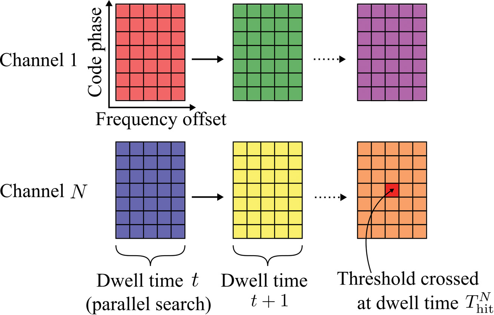

# Rectangles



This is an experiment to teach myself C++ and 3D graphics programming. Rather than dive into OpenFrameworks or Ogre, I thought I would teach myself the basics of C++ from the beginning, compare/contrast with other languages I am familiar with and then add something like OF to the mix later.

I have been following the tutorials [here](http://ogldev.atspace.co.uk/).

## Build Steps

```bash
# Build
make app

# Run
./app

# Clean
make clean

# Clean, Build and Run
make br
```
